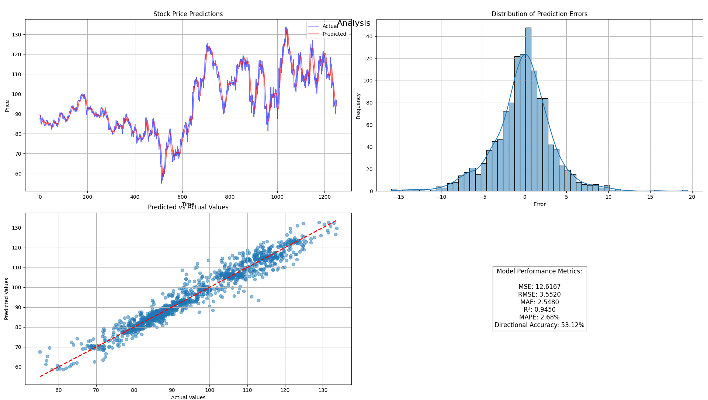
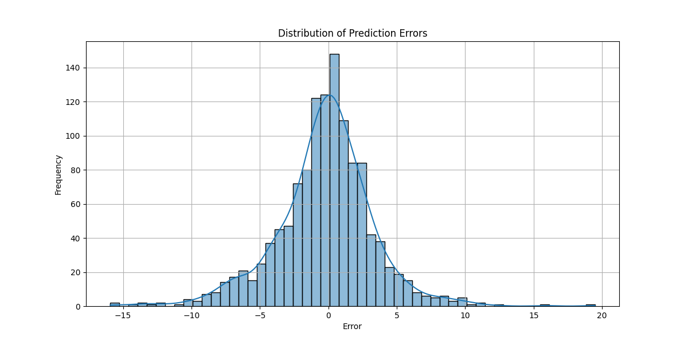
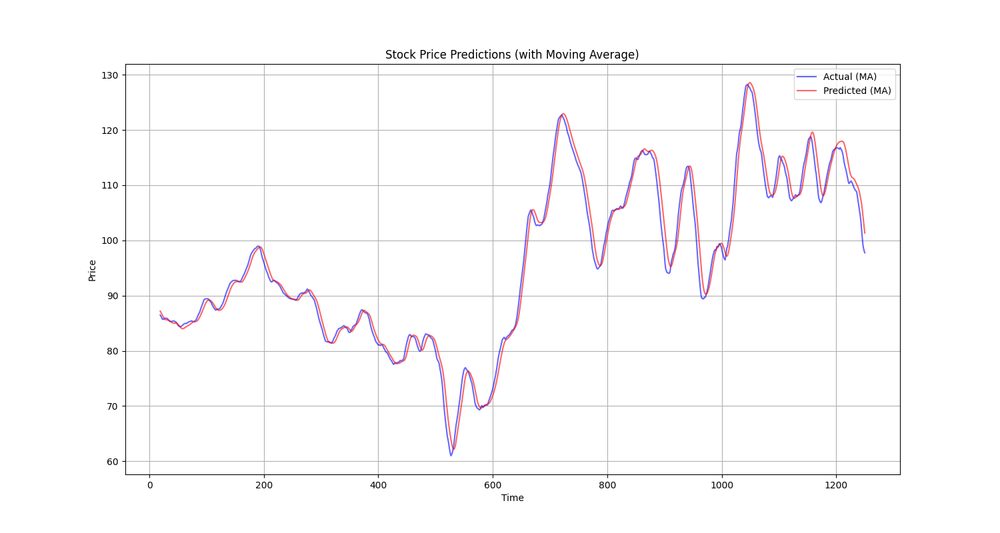
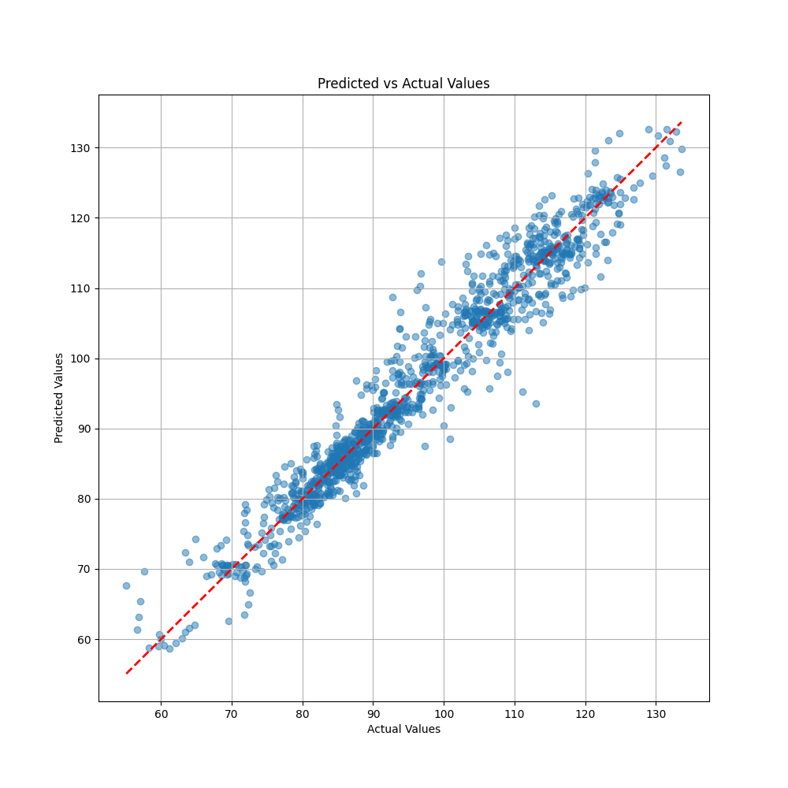
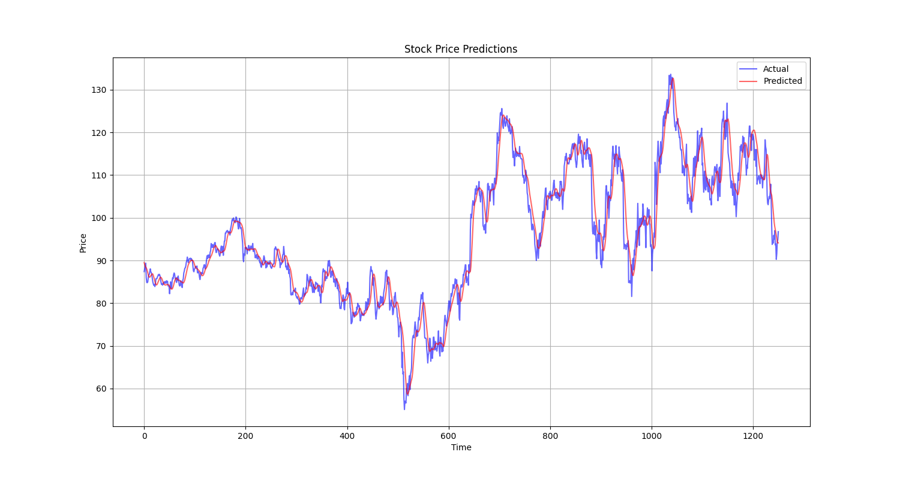

# Stock Price Prediction with LSTM

This is a simple demonstration of stock price prediction with LSTM

LSTM layers are in `config.json` and can be modified.

config also contains other configurations for the model

Results:

| Metric               | Value   |
|----------------------|---------|
| MSE                  | 12.6167 |
| RMSE                 | 3.5520  |
| MAE                  | 2.5480  |
| R2                   | 0.9450  |
| MAPE                 | 2.6787  |
| Directional Accuracy | 53.12%  |

Graphs:

Combined:

Error distribution:

Moving Average:

Predictions vs Actual:

Predictions:

